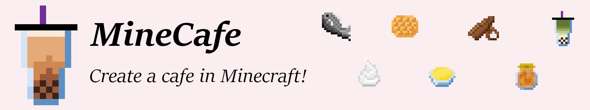
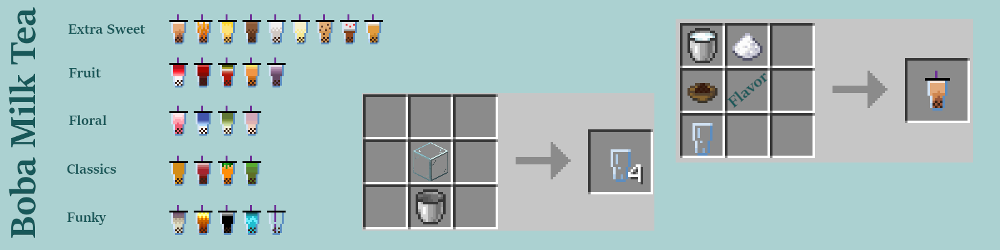
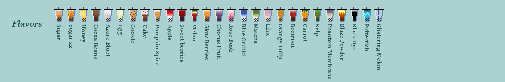
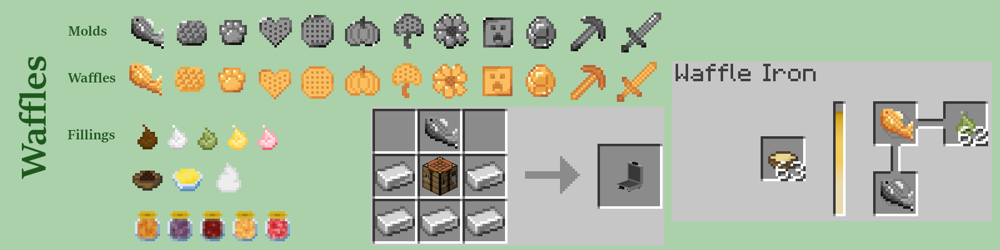
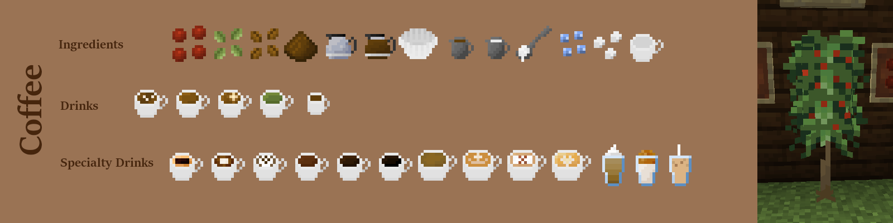
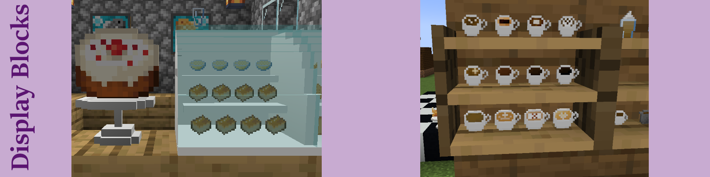
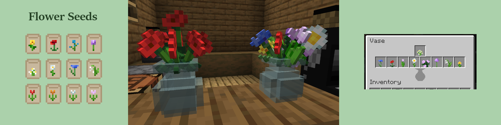
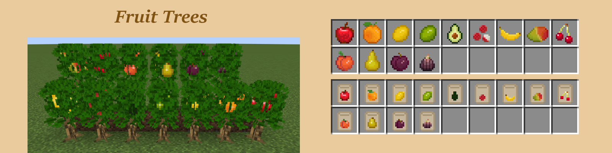
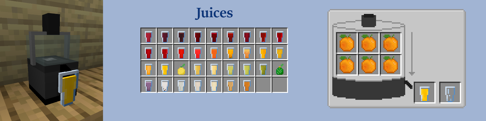
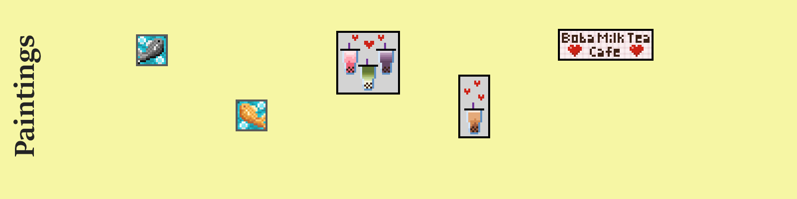

# MineCafe Mod

A [Forge](https://www.curseforge.com/minecraft/mc-mods/minecafe) mod that adds a variety of cafe-related blocks, drinks, foods, and crops to minecraft.

### Note
All textures and models are custom-made by me. 
They cannot be used elsewhere for free. 
They cannot be used elsewhere without permission from me. 
You must consult with me before you use any of my mod's assets.

## Compatability
- Compiled with JEI for crafting recipe support
- Currently focusing on Minecraft 1.19.3 (will work on backporting when I have more time)

---
# What's in the mod?

---

## FAQs:
- Can I use this in a ModPack? Yes
- Can I translate this mod? Sure
- Can I make a Resource/Data Pack? Sure
- Can I contribute to this mod? Sure, just make a pull request on GitHub
- Can I reupload this mod? Nope, no way
- Can I sell this mod? Nope, no way
- Can I use textures/models from this mod? Not for free, and not without getting my permission first!
- Can you port to 1.xx version? Currently I'm only working on 1.19.3, and I'll work on backporting when I have more time <3
- Can you make a Fabric version? I'm not familiar with modding in Fabric, but if someone who is familiar with Fabric wants to collaborate, I'm open to that (please message me first!)
